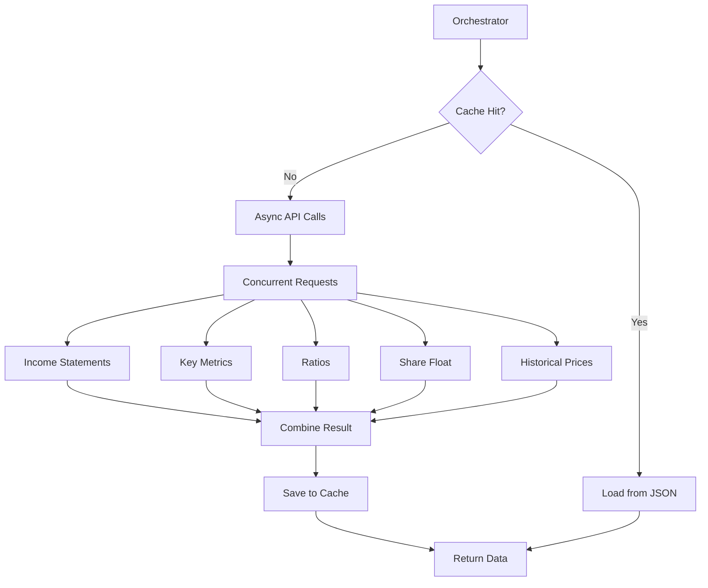

# Plan: Refinement of Data Fetchers

This plan outlines the steps to enhance the data fetching layer of the Techno-Quantamental Analyzer (TQA) to support the full deterministic screening requirements and improve system robustness.

## 1. Enhancements to `BaseDataFetcher` ([`src/tqa/data_fetchers/base.py`](src/tqa/data_fetchers/base.py))

*   **Session Context Management:** Refactor to use an async context manager for the `aiohttp.ClientSession` to ensure proper cleanup.
*   **Enhanced Retry Logic:** Implement more robust retry logic with configurable backoff and specific handling for different HTTP status codes.
*   **Logging Improvements:** Add more granular logging for cache hits/misses, network requests, and errors.
*   **Validation:** Integrate basic validation of response formats (e.g., ensuring it's a list or dict as expected).

## 2. Refinement of `FMPClient` ([`src/tqa/data_fetchers/fmp.py`](src/tqa/data_fetchers/fmp.py))

*   **New Endpoints:** Add methods for:
    *   `fetch_key_metrics(ticker, period='quarter', limit=4)`: For ROE, ROIC, and other efficiency metrics.
    *   `fetch_financial_ratios(ticker, period='quarter', limit=4)`: For margin analysis (gross, operating, net).
    *   `fetch_share_float(ticker)`: For supply/demand analysis (low float detection).
*   **Refined `fetch_ticker_data`:** Update the orchestrator to fetch all these metrics concurrently using `asyncio.gather`.
*   **Schema Alignment:** Ensure the returned dictionary structure matches the expectations of the `screener` module (to be refined next).

## 3. Subscription Constraints & Fallbacks

Based on a review of `notebooks/fmp-api.ipynb`, several endpoints have restricted access under the "Standard" plan or require specific parameters for compatibility.

### Restricted/Premium Endpoints (Avoid for Primary Logic):
*   **Analyst Estimates:** Restricted/Premium query parameters (e.g., `period='quarter'`).
*   **Income Statement TTM:** Failed with `JSONDecodeError` (likely restricted).
*   **Batch Quote:** Restricted/Premium endpoint.
*   **Institutional Ownership Summary:** Restricted/Premium endpoint.

### Fallback Strategies:
*   **Growth Calculations:** Rely on quarterly `income-statement` data for year-over-year growth instead of `income-statement-ttm`.
*   **Technical Analysis:** Calculate SMAs and other indicators locally from the `historical-price-eod/full` data (as noted in [`TODO.md`](TODO.md)) to reduce API dependency and bypass potentially restricted technical endpoints.
*   **Real-time Prices:** Use the standard `stock-quote` endpoint (or `historical-price-eod/light`) if batching is restricted.

## 4. Data Structure Refinement

The `fetch_ticker_data` result will be structured as follows:

```python
{
    "ticker": "AAPL",
    "income_statement": [...],
    "key_metrics": [...],
    "ratios": [...],
    "share_float": {...},
    "historical": [...]
}
```

## 4. Proposed Implementation Steps

1.  **Step 1:** Update `BaseDataFetcher` with improved session management and logging.
2.  **Step 2:** Implement the new FMP endpoint methods.
3.  **Step 3:** Update `fetch_ticker_data` to aggregate all metrics.
4.  **Step 4:** Verify caching works correctly for the new endpoints.

## 5. Mermaid Workflow


