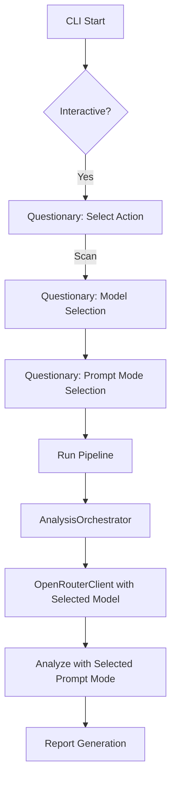

# Plan: CLI UI Enhancement and Bug Fix

The goal is to improve the CLI's interactive selection for advanced options and fix a bug where selected LLM models were not being respected during the analysis phase.

## Problem Analysis
1. **Bug**: `AnalysisOrchestrator` hardcodes the use of `settings.DEFAULT_MODEL` by initializing `OpenRouterClient` without arguments. It also hardcodes the prompt mode to `settings.DEFAULT_PROMPT_KEY`.
2. **UI/UX**: The current `rich.prompt.Prompt` requires typing out long model names (e.g., `google/gemini-3-flash-preview`), which is error-prone and tedious.

## Proposed Changes

### 1. Dependency Management
- Add `questionary` to `pyproject.toml` to support interactive select menus with arrow key navigation.

### 2. Core Logic Refactoring (`src/tqa/llm/orchestrator.py`)
- Update `AnalysisOrchestrator.analyze_multiple` to accept `model` and `prompt_mode`.
- Pass the `model` to the `OpenRouterClient` constructor.
- Pass the `prompt_mode` to `_process_ticker` and then to `client.analyze_ticker`.

### 3. Pipeline Update (`main.py`)
- Ensure `run_pipeline` passes the `model` and `prompt_mode` arguments down to `orchestrator.analyze_multiple`.

### 4. CLI Enhancement (`main.py`)
- Import `questionary`.
- Replace `Prompt.ask` for models and prompt modes with `questionary.select(...).ask()`.
- Use `questionary` for the initial "What would you like to do?" choice as well for consistency.

## Mermaid Workflow

## Implementation Steps
1. **Add Dependency**: Update `pyproject.toml`.
2. **Refactor Orchestrator**: 
    - Change `analyze_multiple(..., model=None, prompt_mode=None)`
    - Change `_process_ticker(..., model=None, prompt_mode=None)`
3. **Update Main**:
    - Update `run_pipeline` call site.
    - Update `scan` command with `questionary`.
4. **Verification**: Run a scan with a non-default model and verify logs.
