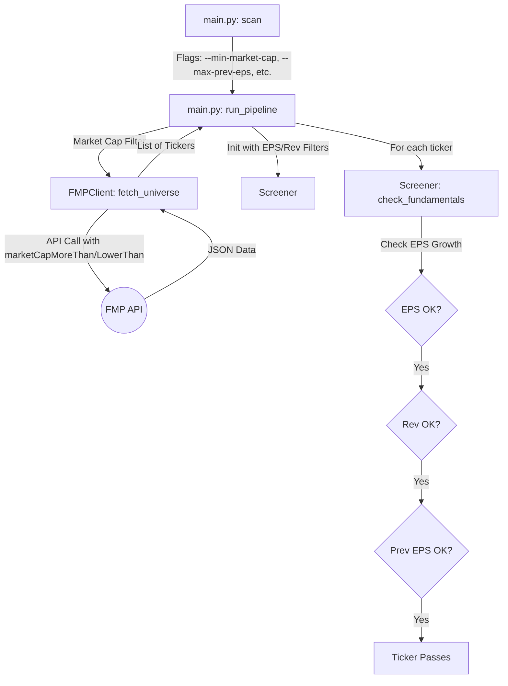

# Plan - Increase CLI Filter Options

This plan outlines the steps to add more filtering options to the CLI, including EPS ranges, revenue growth ranges, and market capitalization ranges.

## 1. Update `src/tqa/screener/universe.py`
- Modify `Screener.__init__` to accept:
  - `max_prev_eps: Optional[float] = None`
  - `max_rev_growth: Optional[float] = None`
- Update `check_fundamentals` method:
  - Apply `max_prev_eps` filter if provided.
  - Apply `max_rev_growth` filter if provided.
  - Ensure `min_rev_growth` is correctly applied (it's currently in `__init__` but we should ensure it's used consistently).

## 2. Update `src/tqa/data_fetchers/fmp.py`
- Modify `FMPClient.fetch_universe` signature to accept:
  - `min_market_cap: Optional[int] = None` (expects absolute dollars)
  - `max_market_cap: Optional[int] = None` (expects absolute dollars)
- Use these values in the `params` dictionary for the `company-screener` endpoint.
- Default to `100,000,000` (100M) for min and `1,000,000,000` (1B) for max if not provided.
- Update the cache `ticker` string to include market cap values to ensure unique caching: `f"UNIVERSE_{min_market_cap}_{max_market_cap}"`.

## 3. Update `main.py`
- Update `run_pipeline` signature to include:
  - `max_prev_eps: Optional[float]`
  - `min_rev_growth: Optional[float]`
  - `max_rev_growth: Optional[float]`
  - `min_market_cap: Optional[float]`
  - `max_market_cap: Optional[float]`
- Update `scan` command to add these as `typer.Option`s:
  - `--max-prev-eps`: Maximum absolute EPS for the previous quarter.
  - `--min-rev-growth-pct`: Minimum YoY Revenue growth %.
  - `--max-rev-growth-pct`: Maximum YoY Revenue growth %.
  - `--min-market-cap`: Minimum market capitalization in **Millions of dollars** (e.g., 100 for $100M).
  - `--max-market-cap`: Maximum market capitalization in **Millions of dollars** (e.g., 1000 for $1B).
- In `scan`, convert the provided market cap values from Millions to absolute dollars (value * 1,000,000) before passing them to `run_pipeline`.
- In `run_pipeline`, pass these absolute dollar values to `client.fetch_universe()`.
- In `run_pipeline`, pass `min_market_cap` and `max_market_cap` to `client.fetch_universe()`.
- In `run_pipeline`, pass the new fundamental filters to the `Screener` constructor.
- Update `session.log_config` to include the new parameters for better traceability.

## 4. Verification
- Run the CLI with new flags to ensure they are accepted.
- Verify that the filters are applied by checking the logs (debug mode).

## Mermaid Diagram of Filter Flow

