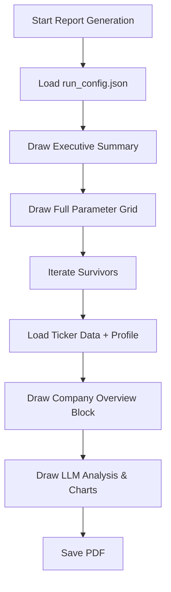

# Enhanced Reporting & Company Profiles Plan

This plan outlines the enhancements to the report generation system to include full configuration transparency and detailed company profile data.

## Objectives

1.  **Full Configuration Visibility**: The PDF report should list every setting used during the run, including fundamental and technical filters.
2.  **Company Profiles**: Each ticker analysis should be preceded by a concise summary of the company's background (Industry, Country, IPO Date, Core Operations).
3.  **Improved Formatting**: Use a multi-column layout in the executive summary for better readability of min/max filter pairs.

## Proposed Changes

### 1. Data Fetching Layer (`src/tqa/data_fetchers/fmp.py`)
- Add `fetch_company_profile(ticker)` to `FMPClient`.
- This will hit the `https://financialmodelingprep.com/stable/profile?symbol={ticker}` endpoint.
- Update `fetch_ticker_data` to optionally include this data.

### 2. Pipeline Orchestration (`main.py`)
- In `run_pipeline`, during the "Deep Metrics Fetch" phase, add a call to `fetch_company_profile`.
- Ensure the profile data is passed through the pipeline and saved in the session's ticker data.

### 3. Report Generation (`src/tqa/utils/report_builder.py`)
- **Executive Summary Refactor**:
    - Iterate through the `run_config.json` and display all sections: `pipeline`, `fundamental_filters`, `market_cap`, and `technical_filters`.
    - Use a helper method to draw parameters in two columns (e.g., `Min EPS Growth` | `Min Rev Growth`).
- **Ticker Section Enhancement**:
    - Add a "Company Overview" block at the top of each stock's page.
    - Fields to include: `Industry`, `Sector`, `CEO`, `Country`, `IPO Date`, and a truncated `Description`.

## Mermaid Workflow

## JSON Structure for Company Profile (Internal)
The following fields from the FMP response will be prioritized:
- `companyName`
- `industry`
- `sector`
- `description` (truncated)
- `ceo`
- `country`
- `ipoDate`
- `website`
