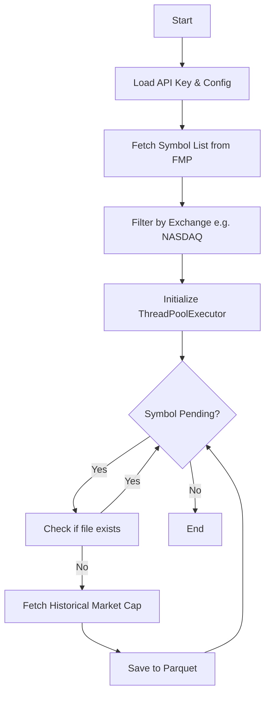

# Plan - Historical Market Cap Downloader

This plan outlines the steps to create a script (starting with a notebook prototype) to download historical market cap data for all stocks in a given exchange using the Financial Modeling Prep (FMP) API.

## 1. Requirements & Analysis

- **Goal**: Download full historical market capitalization data for all stocks in an exchange (e.g., NASDAQ).
- **API Endpoint**: `https://financialmodelingprep.com/stable/historical-market-capitalization?symbol={symbol}`
- **Output Format**: Parquet (for efficiency and compatibility with existing price data storage).
- **Storage Strategy**: Partitioned by the first character of the symbol (e.g., `data/historical-market-cap/A/AAPL.parquet`).
- **Performance**: Use `ThreadPoolExecutor` for parallel I/O-bound API requests, similar to existing downloaders in the project.
- **Resumability**: Check if the file already exists before downloading.

## 2. Technical Specification

### 2.1 Symbol Retrieval
- Use the `stock-list` endpoint or a previously saved `stock-list.csv`.
- Filter by `exchange` (e.g., "NASDAQ", "NYSE").

### 2.2 Data Fetching
- Function `fetch_historical_mktcap(symbol)`:
    - Handle 429 (Rate Limit) with exponential backoff.
    - Handle 5xx errors.
    - Return a DataFrame of the results.

### 2.3 Data Storage
- Save each symbol's history as a individual Parquet file.
- Path: `data/historical-market-cap/{first_char}/{symbol}.parquet`

## 3. Implementation Steps

### Step 1: Create Prototype Notebook
- Path: `notebooks/fmp-full-download/4-historical-mktcap.ipynb`
- Initial cells for configuration (API Key, Target Exchange, Output Dir).

### Step 2: Implement Symbol List Fetcher
- Fetch the full list of symbols from FMP.
- Filter for the target exchange.
- Save to `data/stock-list.csv` if it doesn't exist.

### Step 3: Implement Downloader Core
- Use `concurrent.futures.ThreadPoolExecutor`.
- Implement `process_symbol(symbol)` function.
- Integrate `tqdm` for progress tracking.

### Step 4: Refactor into Script (Optional)
- Once the notebook is stable, create `notebooks/fmp-full-download/4-historical-mktcap.py`.

### Step 5: Update FMPClient (Recommended)
- Add `fetch_historical_market_cap(self, ticker: str)` to `src/tqa/data_fetchers/fmp.py`.

## 4. Verification
- Verify a few downloaded Parquet files using `pandas.read_parquet`.
- Check for data gaps.

## 5. Mermaid Diagram

