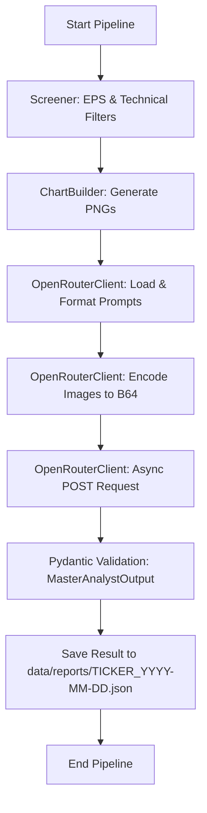

# Plan: OpenRouter Integration (Async)

We will implement the `OpenRouterClient` to enable the first LLM-driven analysis in the pipeline. This client will handle asynchronous communication with OpenRouter using `aiohttp`, aligning with the existing async data fetching pipeline.

## 1. Objectives
- Establish a robust, asynchronous connection to OpenRouter.
- Implement base64 image encoding for attaching charts to prompts.
- Enforce strict Pydantic schema validation using OpenRouter's `response_format`.
- Dynamically load and format prompt templates from `config/prompts.yaml`.
- Integrate with `main.py` for end-to-end orchestration.

## 2. Proposed Architecture

### `OpenRouterClient` (`src/tqa/llm/openrouter.py`)
The client will use `aiohttp` for non-blocking API calls.

```python
class OpenRouterClient:
    def __init__(self, api_key: str, model: str = "anthropic/claude-3.5-sonnet"):
        self.api_key = api_key
        self.model = model
        self.base_url = "https://openrouter.ai/api/v1/chat/completions"

    async def analyze_ticker(
        self, 
        ticker: str, 
        fundamentals: dict, 
        chart_paths: dict[str, str],
        prompt_key: str = "master_analyst"
    ) -> MasterAnalystOutput:
        # 1. Load prompts from config/prompts.yaml
        # 2. Format the user prompt with ticker and fundamental JSON
        # 3. Encode charts (daily/weekly) to base64
        # 4. Construct the messages payload (System + User with images)
        # 5. Execute async POST request to OpenRouter
        # 6. Parse and validate response into MasterAnalystOutput
        pass
```

## 3. Implementation Details

### Image Encoding & Payload Construction
We need a utility to convert PNG charts into base64 strings for the Vision LLM:
```python
def encode_image_base64(path: str) -> str:
    with open(path, "rb") as image_file:
        return base64.b64encode(image_file.read()).decode("utf-8")
```

The payload will include the images in the `content` list:
```python
"content": [
    {"type": "text", "text": formatted_user_prompt},
    {
        "type": "image_url",
        "image_url": {"url": f"data:image/png;base64,{daily_b64}"}
    },
    {
        "type": "image_url",
        "image_url": {"url": f"data:image/png;base64,{weekly_b64}"}
    }
]
```

### Prompt Management
Prompts are stored in `config/prompts.yaml`. We will use `PyYAML` to load them and `str.format()` for injection.

## 4. Todo List
- [x] Review and revise `docs/plans/2-openrouter-integration.md` to use `aiohttp`
- [ ] Implement `OpenRouterClient` in `src/tqa/llm/openrouter.py`
    - [ ] Add `encode_image_base64` utility
    - [ ] Implement `_load_prompts` helper
    - [ ] Implement `analyze_ticker` with `aiohttp` and `response_format`
- [ ] Update `main.py` to:
    - [ ] Initialize `OpenRouterClient`
    - [ ] Execute analysis for tickers passing filters
    - [ ] Save output JSON to `data/reports/`
- [ ] Create `tests/test_openrouter.py` for integration testing
- [ ] Update `docs/ROADMAP.md`

## 5. Workflow Diagram


