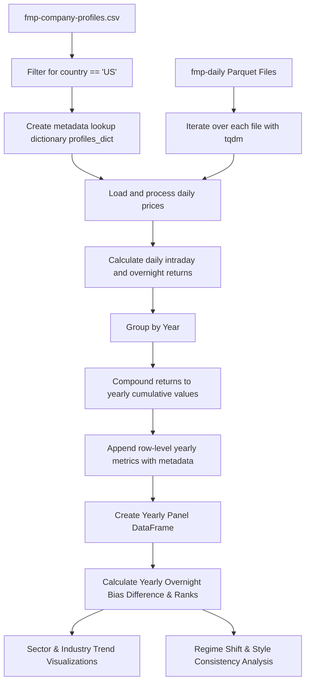

# Plan: Overnight Holding Effect Quantitative Analysis

## 1. Analysis of Existing Inefficiencies & Bugs
In our thorough review of the current [`notebooks/night-effect.ipynb`](notebooks/night-effect.ipynb), we identified several key inefficiencies and bugs:
- **Major Schema Mismatch Bug**: In the previous quick iteration, `load_all_prices_and_metadata` was updated to aggregate statistics on-the-fly to avoid memory bloat, returning a single row per stock. However, subsequent cells (such as `generate_summary_statistics` and `plot_strategies`) still expect `df_all` to contain the raw daily timeseries returns (e.g. `group['intraday_return']`). Running the notebook as-is will raise a `KeyError: 'intraday_return'`.
- **Memory Bloat vs. Aggregate Loss**: 
  - Loading the entire daily timeseries for all ~18,700 stocks results in a giant DataFrame (tens of millions of rows), which causes out-of-memory errors and extremely slow join operations.
  - Collapsing the entire history to a single average row per stock loses all temporal information, making it impossible to "efficiently track the ratios over time and analyze if certain stocks, sectors, or industries have shifted ratios."
- **Lack of US Filtering**: The current script scans all files without filtering for US stocks first, leading to currency, exchange, and time zone mismatch noise (e.g., non-US stocks trading on different market hours and under different currency regimes).

---

## 2. Refined Research Methodology (The Quant approach)
To resolve these issues, we will restructure the research pipeline as follows:

### A. Highly Optimized Panel Data Loading
Instead of keeping a daily timeseries or collapsing to a single summary row, we will load, process, and group daily data into **yearly intervals** *per stock* on-the-fly.
- For each stock file:
  - Load only the required columns (`date`, `open`, `close`) from the Parquet files using [`pd.read_parquet()`](notebooks/fmp-full-download/3-inspect-prices.ipynb:184).
  - Calculate daily `intraday_return` and `overnight_return`.
  - Extract the year and group by `year`.
  - Compute yearly cumulative compounded returns for both strategies, plus the buy-and-hold (total) return:
    $$\text{Cumulative Return} = \prod (1 + R_t) - 1$$
  - Extract the average annualized volatility and count of trading days for that year.
  - Append the resulting list of yearly rows to our panel dataset.
- This creates a **lightweight, multi-period panel dataset** of size:
  $$\approx 5,000\text{ US stocks} \times 20\text{ years} = 100,000\text{ rows}$$
  This is extremely memory-efficient, lightning-fast to manipulate, and fully preserves the temporal dimension.

### B. Filtering for US-Only Stocks
- We will filter our company profiles using the `country` column in [`/opt/rws/data/fmp/fmp-company-profiles.csv`](/opt/rws/data/fmp/fmp-company-profiles.csv) to only include `'US'` stocks.
- We will map their corresponding `symbol_key` (formatted with underscores instead of dots/slashes) to allow O(1) dictionary lookups during the load loop.

### C. Temporal & Shift Analysis
Using the yearly panel dataset, we can answer the following sophisticated research questions:
1. **Ratio/Premium Tracking over Time**:
   - For each stock-year, we will compute the **Overnight Bias Difference**:
     $$\text{Overnight Bias} = \text{Cumulative Overnight Return} - \text{Cumulative Intraday Return}$$
     *Note: We prefer the difference over the ratio because a ratio can be highly unstable when intraday returns are close to zero or have different signs.*
2. **Sector & Industry Shift Analysis**:
   - Group the panel by `year` and `sector` (or `industry`) and calculate the mean/median overnight premium.
   - Plot the trajectory of the overnight vs. intraday performance across different sectors over time to see where the shift occurred.
3. **Statistical Shift Detection**:
   - Determine if there has been a significant structural change or regime shift in the overnight premium over different market eras (e.g. pre-2010 vs. post-2010, or during high-volatility years).

---

## 3. Implementation Steps in notebooks/night-effect.ipynb

### Step 1: Imports and US-only Configuration
Set up the configurations, filter the metadata profiles for `country == 'US'`, and map `symbol_key` to a lookup dictionary containing `symbol`, `sector`, and `industry`.

### Step 2: Optimized Yearly Panel Dataset Loader
Implement the yearly aggregation function that loops through files, computes annual returns, maps metadata, and constructs the panel DataFrame.

### Step 3: Global & Sectoral Trajectory Analysis
Analyze the aggregate overnight vs. intraday trend over time. We will write code to plot the average overnight premium over the years for the entire US market and break it down by Sector.

### Step 4: Industry & Stock-Level Regime Shift Analysis
Highlight specific industries or sectors where the overnight effect has shifted most dramatically (e.g., Technology vs. Financials) and identify the top stocks that exhibit the most stable overnight bias.

---

## 4. Mermaid Flowchart of the Quant Pipeline

