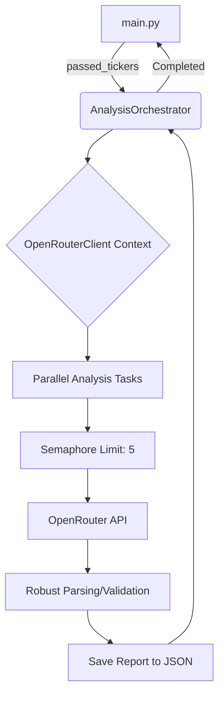

# Design: LLM Orchestration Refactor

This document outlines the refactor of the LLM orchestration layer to improve efficiency, reliability, and maintainability.

## 1. Session Management: `OpenRouterClient`

To avoid the overhead of creating and closing a TCP connection for every ticker analysis, `OpenRouterClient` will adopt the async context manager pattern, consistent with `FMPClient`.

### Decision: Internal Session Management
We will implement `__aenter__` and `__aexit__` in `OpenRouterClient`. This allows the client to manage its own `aiohttp.ClientSession` while providing a clean interface for the orchestrator.

**Changes in `src/tqa/llm/openrouter.py`:**
- Add `self._session: Optional[aiohttp.ClientSession] = None` to `__init__`.
- Implement `__aenter__` to initialize `self._session`.
- Implement `__aexit__` and `close()` to ensure the session is closed properly.
- Modify `analyze_ticker` to use `self._session` instead of creating a new one.

## 2. Robust Parsing and Validation

LLM outputs can sometimes be malformed or contain extraneous characters (like markdown backticks). We will implement a robust parsing flow.

**Parsing Logic:**
1.  **Extraction**: Extract `content` from the OpenRouter response.
2.  **Cleaning**: Remove potential markdown code blocks (e.g., ```json ... ```).
3.  **JSON Decoding**: Attempt `json.loads()`. Catch `json.JSONDecodeError`.
4.  **Schema Validation**: Use Pydantic's `model_validate` (or `model_validate_json`). Catch `pydantic.ValidationError`.
5.  **Error Handling**: If any step fails, log the raw response and the specific error, then return `None`.

## 3. Parallel Orchestration: `AnalysisOrchestrator`

We will extract the analysis logic from `main.py` into a dedicated `AnalysisOrchestrator` class in `src/tqa/llm/orchestrator.py`. This class will handle parallel execution and report persistence.

### Concurrency Control
We will use an `asyncio.Semaphore` to limit the number of concurrent requests to OpenRouter, preventing rate limits and excessive resource consumption.

**Orchestrator Responsibilities:**
- Managing the `OpenRouterClient` lifecycle.
- Orchestrating parallel `analyze_ticker` calls using `asyncio.gather`.
- Enforcing concurrency limits via `Semaphore` (default = 5).
- Handling report generation and saving to `data/reports/`.



## 4. Implementation Details

### `AnalysisOrchestrator` Structure
```python
class AnalysisOrchestrator:
    def __init__(self, semaphore_limit: int = 5):
        self.semaphore = asyncio.Semaphore(semaphore_limit)

    async def run_batch(self, tickers_data: List[Dict[str, Any]]):
        async with OpenRouterClient() as client:
            tasks = [self._process_ticker(client, data) for data in tickers_data]
            return await asyncio.gather(*tasks)

    async def _process_ticker(self, client, data):
        async with self.semaphore:
            # 1. Analyze
            # 2. Save Report
            # 3. Return result
```

### Report Naming Convention
Reports will be saved in `data/reports/` with the format `{ticker}_{YYYY-MM-DD}.json`.

## 5. Integration into `main.py`

The logic in `main.py` will be simplified to:
```python
# Phase 4: LLM Analysis
status.update(f"[bold magenta]Phase 4: Performing Parallel LLM Analysis...")
orchestrator = AnalysisOrchestrator(semaphore_limit=settings.MAX_CONCURRENT_LLM_REQUESTS)
results = await orchestrator.run_batch(passed_tickers)
```

## 6. Todo List for Implementation

- [ ] Refactor `OpenRouterClient` to support async context manager.
- [ ] Implement `_parse_and_validate` in `OpenRouterClient`.
- [ ] Create `src/tqa/llm/orchestrator.py` with `AnalysisOrchestrator`.
- [ ] Update `main.py` to use `AnalysisOrchestrator`.
- [ ] Update `config/settings.py` to include `MAX_CONCURRENT_LLM_REQUESTS`.
