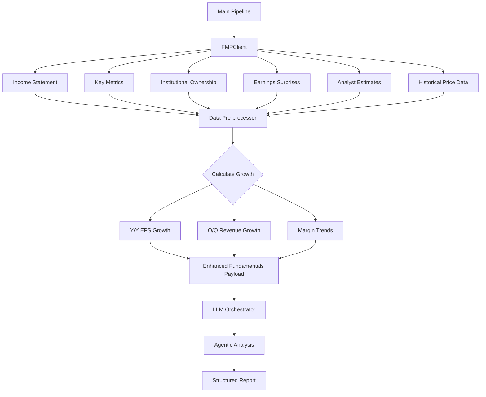

# Plan: Enhancing Agentic Analysis with Deeper Fundamentals

This plan outlines the steps to improve the quality of LLM analyses by providing richer fundamental data (Institutional Ownership, Earnings Surprises, Forward Estimates) and pre-calculating key growth metrics.

## 1. Data Fetcher Enhancements (`src/tqa/data_fetchers/fmp.py`)
- Implement `fetch_institutional_ownership`: Use the `institutional-ownership/symbol-positions-summary` endpoint.
- Implement `fetch_earnings_history`: Use the `earnings` endpoint to get actual vs. estimated EPS/Revenue.
- Implement `fetch_analyst_estimates`: Use the `analyst-estimates` endpoint for forward-looking growth projections.
- (Optional) Implement `fetch_ticker_news`: Check if `v3/stock_news` is available to provide recent catalysts.

## 2. Payload Pre-processing
- Create a utility to calculate:
    - **EPS Growth (Y/Y and Q/Q)**: Percent change across the last 4-8 quarters.
    - **Revenue Growth (Y/Y and Q/Q)**: Percent change across the last 4-8 quarters.
    - **Margin Trends**: Expansion/Contraction in Gross and Operating margins.
    - **Surprise Factor**: Average earnings surprise over the last 4 quarters.
- Add these calculated metrics to the `fundamentals` payload sent to the LLM.

## 3. Prompt Refinement (`config/prompts.yaml`)
- Update `master_analyst` and `can_slim_growth` prompts to:
    - Explicitly ask the model to look at `institutional_ownership` for big money backing.
    - Analyze `earnings_surprises` for evidence of "under-promising and over-delivering."
    - Evaluate `analyst_estimates` to confirm future growth expectations.
    - Utilize the `calculated_metrics` to confirm the 20%+ growth requirement.

## 4. Documentation Update
- Update `docs/ARCHITECTURE.md` to include these new data nodes in the data flow diagram and descriptions.

## Mermaid Diagram: Enhanced Data Flow

## Review Questions
- Should we fetch peer data as well, or is sector/industry context sufficient?
- How many quarters of "Surprise" history should we provide? (Proposed: 4)
- Should news articles be summarized by a separate LLM pass or sent raw? (Proposed: Top 5 headlines/snippets raw)
