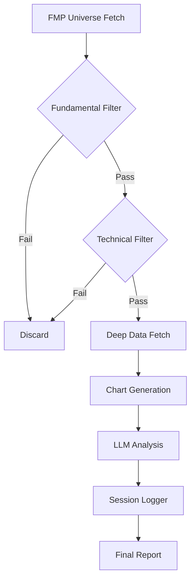

# Plan: Universe Scanning & Filtering Refinement

This plan outlines the steps to implement a more robust and efficient stock scanning pipeline, focusing on "strongest stocks" using the Trend Template and enhancing auditability through extensive logging.

## 1. Advanced Deterministic Screener (`src/tqa/screener/universe.py`)
- **Objective:** Ruthlessly filter the universe to only the top 1-2% of stocks before LLM analysis.
- **Tasks:**
    - Refactor `Screener` to support "Phase 1" (Fundamental) and "Phase 2" (Technical) filters.
    - Implement `check_trend_template()`:
        - Price > SMA 100 > SMA 200.
        - SMA 200 trending up (e.g., current > average of last 20 days).
        - Relative Strength: Price > SMA 50.
        - Distance from Highs/Lows (e.g., < 25% from 52w high, > 30% from 52w low).
    - Implement `check_fundamental_strength()`:
        - EPS Growth > 20% YoY.
        - Revenue Growth > 20% YoY.
        - Acceleration check (Growth Q1 > Growth Q2).

## 2. Optimized Data Ingestion (`src/tqa/data_fetchers/fmp.py` & `main.py`)
- **Objective:** Reduce bandwidth and latency by fetching only necessary data for survivors.
- **Tasks:**
    - Enhance `FMPClient` to fetch latest quotes/SMAs in bulk if possible.
    - Modify `main.py` to use a staged "waterfall" fetching strategy:
        1. Fetch Universe (Symbols).
        2. Fetch Quarterly Income Statements (Small payload) -> Filter Fundamentals.
        3. Fetch Latest Technical Indicators (Price, SMAs, 52w Range) -> Filter Technicals.
        4. Fetch FULL data (Historical, Key Metrics, News) ONLY for final survivors.

## 3. Session Logging & Auditability (`src/tqa/utils/session_logger.py`)
- **Objective:** Maintain a perfect record of why decisions were made by the agent.
- **Tasks:**
    - Create a `SessionLogger` that initializes a run-specific directory in `data/reports/runs/YYYYMMDD_HHMMSS/`.
    - Save `run_config.json`: The CLI arguments and settings used.
    - Save `prompt_debug.jsonl`: Every prompt sent to the LLM and its raw response.
    - Save `final_results.json`: The aggregated analysis of all processed tickers.

## 4. CLI Tool Refinement (`main.py`)
- **Objective:** Improve user experience and debugging capabilities.
- **Tasks:**
    - Add `--save-prompts` flag to enable the `SessionLogger` debug output.
    - Add `--limit-survivors` to cap the number of stocks sent to LLM (cost control).
    - Add `--skip-filters` for analyzing specific tickers directly.
    - Implement the `report` command to generate a Markdown summary from a session directory.

## 5. Future Enhancements
- **Relative Strength (RS) Filter:** Implement RS calculation compared to a benchmark (e.g., S&P 500) to ensure we are only picking stocks outperforming the broader market.

## 6. Documentation & Roadmap
- **Tasks:**
    - Update `docs/ARCHITECTURE.md` to include the Session Logging and Waterfall Data fetching layers.
    - Update `docs/ROADMAP.md` to reflect completion of Phase 1 and detailed Phase 2 steps.

## Mermaid Workflow

