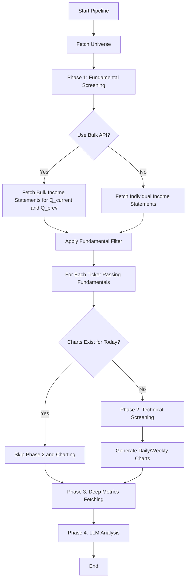

# Plan: Optimize Chart Generation and API Efficiency

This plan addresses the redundant chart generation and improves the efficiency of the screening pipeline using bulk API endpoints.

## 1. Chart Generation Optimization
Currently, charts are generated on every run without checking for existing files. We will implement date-suffixed filenames and a check mechanism.

### 1.1 Update `ChartBuilder` (`src/tqa/charting/builder.py`)
- Modify `generate_daily_chart` and `generate_weekly_chart` to use filenames like `TICKER_daily_YYYY-MM-DD.png`.
- Add `check_existing_charts(ticker: str) -> bool` to verify if both daily and weekly charts exist for today.

### 1.2 Update `main.py`
- Before entering Phase 2 (Technicals) and Chart Generation, check if charts for the ticker already exist.
- If charts exist, skip technical data fetching, technical screening, and chart generation for that ticker, as it has already passed today.

## 2. Bulk API Integration for Screening
Instead of making hundreds of individual API calls for income statements during Phase 1, we will use FMP's bulk endpoints.

### 2.1 Update `FMPClient` (`src/tqa/data_fetchers/fmp.py`)
- Implement `fetch_income_statement_bulk(year: int, period: str)`.
- This endpoint returns a large list of income statements for all tickers for that period.

### 2.2 Refactor Phase 1 in `main.py`
- Calculate the current and previous quarters.
- Fetch bulk income statements for both quarters.
- Reorganize the data to be compatible with the `Screener`'s expectations.
- This replaces the $N$ individual calls with 2 bulk calls.

## 3. Workflow Diagram

## 4. Implementation Details

### Filename Pattern
`data/charts/{TICKER}_{TIMEFRAME}_{YYYY-MM-DD}.png`

### Bulk Data Handling
The bulk API returns a list of dictionaries. We will create a lookup map (ticker -> statements) to quickly feed the screener.

---
**Next Steps:**
1. Switch to **Code Mode** to implement `ChartBuilder` changes.
2. Implement `FMPClient` bulk methods.
3. Update `main.py` pipeline logic.
